<h1 align="center">
INSURANCE CROSS-SELLING STRATEGY<br>
</h1>

<h6>- <a href="/">VERSÃO EM PORTUGUÊS</a></h6>


# 1. INTRODUCTION

What is this project about? The challenge is to create an intelligent method to select the customers most likely to purchase a new product from an insurance company. This is therefore a business case analysis, with a focus on increasing the company’s revenue as well as addressing the key concerns of the business team.

As will be presented throughout the project, using this approach, it was possible to increase the sales campaign performance by approximately 141%, with an estimated revenue increase of more than 180%, representing an absolute revenue boost of around $140 million.

This project is based on a fictional case and uses a dataset from [Kaggle](https://www.kaggle.com/datasets/anmolkumar/health-insurance-cross-sell-prediction). However, it is important to emphasize that the MAIN FOCUS is not just the creation of a machine learning solution for a data science competition, but rather the analysis of the business as a whole, aiming to understand the factors that impact performance, with the goal of increasing the company’s revenue and profitability.


# 2. THE COMPANY AND THE PRODUCT

In this fictional context, the company <b>Insurance All</b> typically provides health insurance to its customers. However, its product team is currently analyzing the possibility of launching a new marketing campaign to offer a different type of coverage to policyholders—automobile insurance.

An insurance contract is defined in Article 757 of the Brazilian Civil Code as an agreement in which a company — the insurer — commits to guaranteeing a specific interest of its client — the insured — against the risk of an event, in exchange for the payment of a premium.

Finally, it is important to clarify that **cross-selling** simply consists of suggesting a product for purchase based on identifying the person's interest in buying another product. Such practice is permitted by law. This lawful practice should not be confused with **tying sales**, which refer to the seller's imposition of the mandatory purchase of one product in order for the buyer to be allowed to acquire another product in which she is actually interested. The latter is a practice prohibited in Brazil under the provisions of Article 39, paragraph one, of the Consumer Protection Act (Law No. 8078/1990).


# 3. THE BUSINESS PROBLEM

In order to improve the results of the new marketing campaign, the data science team was tasked with building a machine learning model to predict whether a customer would be interested in purchasing automobile insurance. As a result of this model, the sales team expects to prioritize the individuals most interested in the new product, optimizing the campaign by contacting only the 20,000 customers identified as the most likely to make a purchase.

In the specific case of **Insurance All**'s auto insurance, a market survey was conducted with approximately 381,000 customers regarding their interest in adopting a new product, thus creating a dataset used in this machine learning project.

The product team also has information on another 127,000 potential new customers who could receive the offer for the new product via phone calls. This group of new customers consists of people who did not respond to the aforementioned interest survey.

However, there is a RESTRICTION: the sales team has the capacity to call and send prospects to only **20,000 people** during the campaign period, making it crucial to select the 20,000 most likely to accept the offer from the 127,000 potential customers.


# 4. SOLUTION PLANNING

## 4.1. Final Product

As described in the business problem, the goal is to develop an ML model to assess customer interest in purchasing automobile insurance. Therefore, the proposed solution includes delivering the following results:

1. Result #1 – Business insights related to the automobile insurance market, based on the available data.
2. Result #2 – A report answering the following three practical questions about the sales campaign: **(2.1)** Among the 20,000 calls made by the sales team, what percentage of customers are likely to be interested in purchasing automobile insurance; **(2.2)** If the sales team’s capacity is increased to 40,000 calls, what percentage of customers will be interested in the product; and **(2.3)** How many calls does the sales team need to make to contact 80% of the customers interested in purchasing automobile insurance?
3. Result #3 – An intelligent Excel spreadsheet for customer prospecting, capable of applying the resulting machine learning model to data on future customers.


## 4.2. Solution Strategy

The project was carried out following the CRISP-DM method (or "Cross Industry Standard Process for Data Mining"), a cyclical approach that enhances the quality and speeds up the delivery of results in Data Science projects. The method can be summarized in the following set of steps:

1. Business understanding
2. Data collection, processing, and modeling
3. Machine Learning algorithms
4. Results evaluation
5. Production deployment.


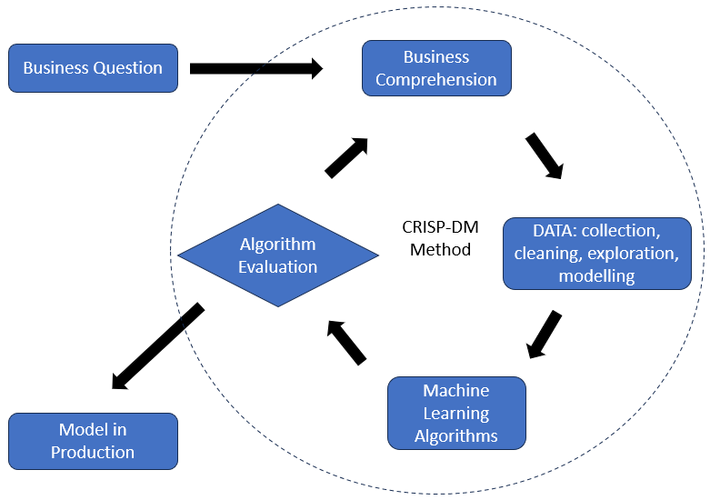


# 5. AVAILABLE DATA

The data is available in the TRAIN.CSV file, consisting of 381,109 records, with the following columns:


<table align="center">
  <tr>
    <th>ATTRIBUTE</th>
    <th>DESCRIPTION AND NOTES</th>
  </tr>
  <tr>
    <td>Id</td>
    <td>Unique identifier for each customer, with a total of 381,109 records.</td>
  </tr>
  <tr>
    <td>Gender</td>
    <td>Customer’s gender (Male/Female).</td>
  </tr>
  <tr>
    <td>Age</td>
    <td>Customer’s age, ranging from 20 to 85 years.</td>
  </tr>
  <tr>
    <td>Driving_License</td>
    <td>Indicator of whether the customer has a driver’s license (1: Yes, 0: No). It is noted that 99.79% of customers have a license.</td>
  </tr>
  <tr>
    <td>Region_Code</td>
    <td>Code for the region where the customer resides. There are 53 regions listed, with no further geographical or social information.</td>
  </tr>
  <tr>
    <td>Previously_Insured</td>
    <td>Indicator of whether the customer already has previous insurance (1: Yes, 0: No). It is noted that 54.18% were previously insured.</td>
  </tr>
  <tr>
    <td>Vehicle_Age</td>
    <td>Vehicle age, categorized as "&lt; 1 Year" (43.24%), "1-2 Years" (52.56%), and "&gt; 2 Years" (4.20%).</td>
  </tr>
  <tr>
    <td>Vehicle_Damage</td>
    <td>Indicator of whether the vehicle was previously damaged, with 50.49% YES and the remaining 49.51% NO.</td>
  </tr>
  <tr>
    <td>Annual_Premium</td>
    <td>Annual premium paid by the insured (ranging from $2,630 to $540,165).</td>
  </tr>
  <tr>
    <td>Policy_Sales_Channel</td>
    <td>The sales channel through which the policy was acquired. This is anonymized information, which may refer to mail, phone, in-person contact, etc. The dataset includes 155 distinct channels, with no further details on their meanings.</td>
  </tr>
  <tr>
    <td>Vintage</td>
    <td>Number of days since the customer was associated with the insurance company (ranging from 10 to 299 days).</td>
  </tr>
  <tr>
    <td>Response</td>
    <td>The customer’s response regarding acceptance of the new product (1: Yes, 0: No). The binary output information is typical of classification problems. Moreover, only 12.26% of responses are YES, indicating heavily imbalanced classes.</td>
  </tr>
</table>


(Source: [Kaggle](https://www.kaggle.com/datasets/anmolkumar/health-insurance-cross-sell-prediction), Health Insurance Cross Sell Prediction)

There is also the TEST.CSV file available, which is similar in format to the one described above, but without the "Response" attribute. Due to the absence of this attribute, this file is not useful during the development and testing phases of the machine learning models and can only be used at the end as test data for the customer prospecting Excel sheet.


# 6. DATA PREPARATION

In an initial inspection, no missing data (NaN) was identified. However, some attributes were converted, new attributes were created, and encoding procedures were applied to others (sections 3.1 and 3.2 of the code). Details are provided below.

## 6.1. Simple Conversions of Categorical Variables

These conversions are based solely on the information contained in the record being modified, ensuring no possibility of data leakage.

- The "vehicle_damage" variable had its text values "Yes" & "No" converted to the numbers 1 & 0.
- The "vehicle_age" variable had its categories renamed from "> 2 Years" to "over_2_years," from "1-2 Years" to "between_1_2_years," and from "< 1 Year" to "below_1_year."
- The "annual_premium" variable was divided into three bands, creating the new variables "annual_premium_f1," "annual_premium_f2," and "annual_premium_f3."

The Python code for these conversions can be consulted in "simple_conversion_of_categorical_features()" method, in section 3.1 of the code.

## 6.2. Bimodal Distribution of the "Age" Variable

Both in the initial descriptive analysis (section 1.3.2 of the code) and in the exploratory analysis (EDA, section 5.1.1 of the code), it was observed that the distribution of the "age" variable indicated the presence of two modes, centered around 23-24 years and 43-44 years. Thus, two new variables were added to represent the similarity between the customer's age and each of those modes. The similarity was computed using RBF – *radial basis function* (Géron<sup>2</sup>, pp. 77-78) to create the variables "age_rbf_24" and "age_rbf_44." The code and the result are illustrated below.

```python
centers = [24, 44]

rbf_24 = rbf_kernel(df3[['age']], [[centers[0]]], gamma=0.030 )
rbf_44 = rbf_kernel(df3[['age']], [[centers[1]]], gamma=0.015 )

df3['age_rbf_24'] = rbf_24
df3['age_rbf_44'] = rbf_44
```

The gamma values can be obtained through optimization; however, in this case, these values were derived by trial and error using the graph.

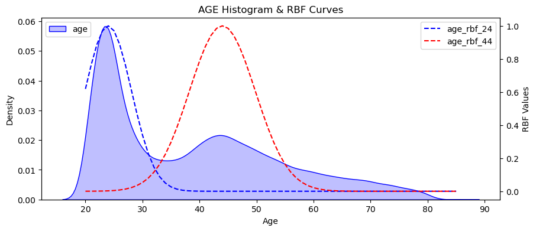

The procedure yielded good results, as in the correlations evaluation phase (section 5.1.1 of the code) and in the variable importance testing phase (section 7), "age_rbf_24" and "age_rbf_44" proved to be important. For more on this, see our [post](https://www.linkedin.com/posts/manoelmendonca-eng-adv_datascience-machinelearning-radialbasisfunction-activity-7234892553542672385-gukQ?utm_source=share&utm_medium=member_desktop). At the time of the post, it seemed appropriate to use only the "age_rbf_43" variable, as well as modes centered in 23 and 43. With the progress of the work and thanks to the suggestion presented<sup>6</sup>, the result was achieved through the use of both variables and adjustments to the modes.

In the case of these variables created using RBF, since they make use of information from the entire distribution, it was necessary to ensure that no data leakage occurred. The modes were defined by observing the training data, and the result was then applied to the validation and test sets. This procedure was embedded in an object created for this purpose (the DataFitAndTransform class, section 3.1 of the code) and used in the cross-validation tests and the final test of the model.


## 6.3. Frequency Encoding of the "Policy_Sales_Channel" Variable

This is a categorical variable with 155 classes (section 1.1 of the code), composed of anonymized data and converted into numbers, without further explanation. Most likely, the most important classes among these 155 will occur more frequently, hence, *frequency encoding* was used to create the variable "policy_sales_channel_importance".

```python
#.......... Policy Sales Channel
aux = out_df.loc[:, ['policy_sales_channel', 'id'] ].groupby('policy_sales_channel').count().reset_index()
aux['policy_sales_channel_importance'] = aux['id'] / aux['id'].max()
self.policy_sales_channel_importance_dict = 
    aux.set_index('policy_sales_channel')['policy_sales_channel_importance'].to_dict()
out_df['policy_sales_channel_importance'] = 
    out_df['policy_sales_channel'].map(self.policy_sales_channel_importance_dict)

self.fe_policy_sales_channel = out_df.groupby('policy_sales_channel').size() / len(out_df)
out_df['policy_sales_channel'] = out_df['policy_sales_channel'].map(self.fe_policy_sales_channel)
```

This processing is part of the DataFitting() method (section 3.1 of the code), designed to prevent data leakage.

It should be observed that after splitting the test set (section 1.2), it was observed that in the remaining training+validation data, the variable 'policy_sales_channel' contained only 152 classes (section 1.3.3).

## 6.4. Encoding of Other Variables

The variables "gender", "region_code" and "vehicle_age" are categorical and were prepared using encoders (section 6.1 of the code) for later use in the machine learning models.

*One hot encoding* was applied to the categorical variables "gender" and "vehicle_age" to convert their classes into binary columns.

For the "region_code" variable, *leave one out encoding* was applied. This technique is similar to *target encoding* but aims to reduce the risk of *overfitting* by excluding the target value of the current row from the calculations (Lewinson<sup>3</sup>, pp. 555-556).

The numerical variable "annual_premium" and its derivatives "annual_premium_f1", "annual_premium_f2" and "annual_premium_f3" were scaled using the StandardScaler() function to achieve a mean of zero and unit variance. Later, it was decided not to use the records related to "annual_premium_f3" because they represented less than 1% of the data and referred to extremely high premium values.

The variables "age" and "vintage" were converted using MaxMinScaler(), confining them to a range between zero and one without altering the shape of their original distributions.

All of this code is part of the DataFitting() and DataTransforming methods (section 3.1 of the code), designed to prevent data leakage.

## 6.5. Relative Importance of Variables

In this area, we tested many techniques (section 7 of the code). Some did not bring any benefits and were discarded, such as *Forward Feature Selection* and *Backward Feature Selection* (Lewinson<sup>3</sup>, pp. 620). Others were quite interesting.

We used the classic Boruta feature selection method in two versions: one using ExtraTrees as the estimator and the other using LightGBM. Both cases indicated the removal of "driving_license", and LightGBM suggested discarding three additional variables.

Another classic approach consists in using the "feature_importances_" parameter from tree-based algorithms (Géron<sup>2</sup>, pp. 221). We applied this technique in two versions as well, using ExtraTrees and LightGBM. The result was intriguing, as some variables received entirely different rankings, as highlighted in the figure below:

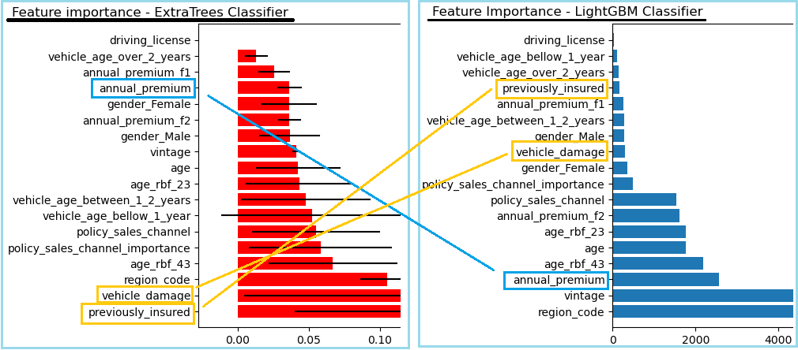

In fact, it is understandable that not all variables that are more suitable for one algorithm will be equally appropriate for other algorithms. Thus, in the absence of conclusive evidence to determine the importance of variables for the chosen algorithm, we resorted to brute force and coded a loop for the gradual exclusion of variables (section 7.5 of the code), as follows:

```python
for i in range( len( cols_selected_boruta ) ):
    selected_features = cols_selected_boruta[:i] + cols_selected_boruta[i+1:]
    ...
```

This gradual exclusion procedure (or *Recursive Feature Elimination*) was repeatedly applied to the best-performing model—LogisticRegression—in order to improve it by removing variables that did not contribute to the result, or even worsened it. Thus, in the first version of the notebook, the variables 'vehicle_age_over_2_years' and 'vehicle_age_between_1_2_years' were excluded, and in the current version two, 'age', 'age_rbf_44', and 'vehicle_age_over_2_years' were excluded, leading to improvements in the Precision, Recall, and F1 indicators. For more on this, see our [post](https://www.linkedin.com/posts/manoelmendonca-eng-adv_datascience-machinelearning-featureselection-activity-7236360978865545219--TO_?utm_source=share&utm_medium=member_desktop).

## 6.6. Data Transformation and Adjustment Pipeline

During the project development, the creation of variables, their transformation, and encoding began to accumulate. At the same time, this entire set of transformations needed to be (i) executed in a consistent order and (ii) applied at different stages of the processing. For example, the transformations needed to be applied both when handling the test data in the final model evaluation and when handling the folds during cross-validation, to avoid data leakage in any of these stages.

Given this scenario, we decided to encapsulate all these procedures into a class, named **DataFitAndTransform** (section 3.1 of the code). The main goal was to ensure consistency in the transformations applied to the data so that the input data would be properly transformed and standardized before being used in the various machine learning models.

The class has the following main methods:

```python
class DataFitAndTransform:
    def __init__(self):
        ...
    def DataFitting(self, in_df, y_train):
        ...
    def DataTransforming(self, in_df):
        ...
    def get_parameters(self):
        ...
```

In the structure above, the `__init__` method defines the class attributes, thus gathering various transformation and scaling objects such as `StandardScaler`, `MinMaxScaler`, `OneHotEncoder`, `LeaveOneOutEncoder`, etc.

The `DataFitting()` method fits the scalers and encoders to the training data and then applies these transformations to this dataset.

The `DataTransforming()` method uses the transformation and scaling objects created in the previous method and applies them to the test data (and also to the validation data, as applicable). In this way, consistency with the procedure applied to the training data is ensured.

The `get_parameters()` method returns a dictionary containing all the fitted scalers and encoders. In this project, it was used for process verification (debugging) and for creating pickle files.

Finally, a practical note: the `DataFitting()` and `DataTransforming()` methods must maintain a similar order of transformations. During development, several processing errors occurred due to failure to observe this aspect.


# 7. TRAINING THE MACHINE LEARNING ALGORITHMS

The process of selecting and building the machine learning model was divided into the following stages:
1. Searching for the classification algorithm capable of delivering the best performance among the following: Logistic Regression, XGBoost, KNN, Random Forest, Extra Trees, and LightGBM.
2. Using the algorithm selected in the previous stage and optimizing its hyperparameters to arrive at the final model.
3. Evaluation in terms of business impact.

Below are some aspects related to the search for the appropriate algorithm.


## 7.1. Splitting the Dataset into Training, Validation, and Testing Sets

The available dataset, containing 381,109 records, was divided into three sets (section 1.2 of the code):

- Test set, with 127,024 records, to replicate the situation described by the client.
- Training set, with 203,268 records, representing 80% of the remaining data.
- Validation set, with 50,817 records, representing 20% of the remaining data.

The test set remained reserved for use in the final evaluation of the resulting ML algorithm (section 10 of the code). The training set was used to train the features' transformations (section 3 of the code). The training and validation sets were used for direct validation of the candidate algorithms (section 8.1 of the code). Later, the two sets were combined (i.e., with 254,085 records) for cross-validation of the algorithms (section 8.2 of the code).


## 7.2. Handling Imbalanced Classes

The preliminary evaluation of the target variable "response" indicated that this is a classification case with imbalanced classes, with the class of interest present in only 12.2% of the records (section 1.3.4 of the code).

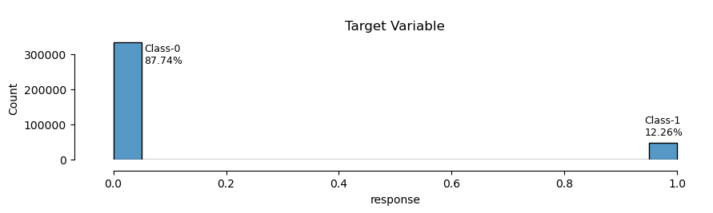

The existence of class imbalance reduces the performance of ML models, as the models assume balance and tend to prioritize the more numerous class, leading to undesirable results when optimizing the model.

There are several techniques to handle imbalanced data that improve the performance of ML models (see Lewinson<sup>3</sup>, pp. 562-572). For this project, we applied a hybrid technique combining SMOTE (*Synthetic Minority Over-sampling Technique*) and Tomek Links (section 6.3 of the code). In short, SMOTE generates new synthetic instances of the minority class, while Tomek helps define the boundaries between the classes by removing majority class instances that are closest to the minority class instances.

Note also that the adopted algorithm, *Logistic Regression*, allows the use of the *class_weight='balanced'* parameter, also with the aim of addressing the issue of imbalanced classes. In this work, both the *class_weight* parameter and SMOTE-Tomek were used together. As a suggestion for a future test, the performance of using one or the other in isolation could be evaluated.

## 7.3. Performance Metrics - Precision & Recall

The *Precision* and *Recall* metrics are specifically designed for binary classification systems with imbalanced classes, making them the ideal metrics for this project (along with F1).

In summary, in this project's dataset, 12.26% of the records belong to class-1, which refers to individuals interested in purchasing the new auto insurance. Through data science techniques, a machine is created to predict which cases belong to class-1. In practice, the machine correctly identifies some cases (the TP group in the figure) but makes two types of errors: it classifies some class-0 cases as class-1 (FP group) and some class-1 cases as class-0 (FN group).

From the universe of records that truly belong to class-1 (TP + FN), it is possible to calculate the percentage of class-1 instances correctly identified (or retrieved) by the machine, which is the *Recall* metric.

Similarly, from the set of instances classified by the machine as class-1 (TP + FP), it is possible to calculate how precise the machine was, which is the *Precision* metric.

On this topic, we prepared two posts: [this one](https://www.linkedin.com/posts/manoelmendonca-eng-adv_precision-recall-activity-7233824260442476544-szPD?utm_source=share&utm_medium=member_desktop) and [this one](https://www.linkedin.com/posts/manoelmendonca-eng-adv_datascience-machinelearning-precision-activity-7235632443515392001-DwBK?utm_source=share&utm_medium=member_desktop).

<table align="center">
<tr><td>
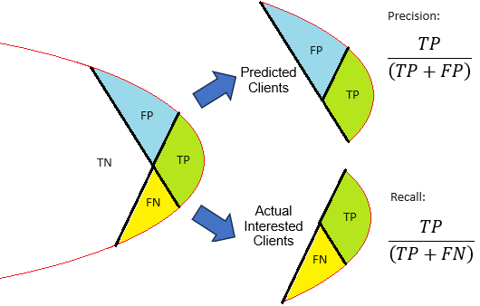
</td></tr>
</table>

Source: Grigorev<sup>4</sup>, pp 128.


## 7.4. Performance of Tested Algorithms

For model evaluation and selection of the most suitable one, the training and validation sets were used for direct validation of the candidate algorithms (section 8.1 of the code). The results are presented in the table below and in the figure further down.

<table align="center">
  <tr>
    <th align="center">Model</th>
    <th align="center">Precision</th>
    <th align="center">Recall</th>
    <th align="center">F1</th>
    <th align="center">TP</th>
  </tr>
  <tr>
    <td align="center">Logistic Reg.</td>
    <td align="center">26.34%</td>
    <td align="center">92.54%</td>
    <td align="center">41.01%</td>
    <td align="center">5743</td>
  </tr>
  <tr>
    <td align="center">XGBoost</td>
    <td align="center">28.38%</td>
    <td align="center">70.66%</td>
    <td align="center">40.50%</td>
    <td align="center">4385</td>
  </tr>
  <tr>
    <td align="center">KNN</td>
    <td align="center">30.78%</td>
    <td align="center">42.17%</td>
    <td align="center">35.59%</td>
    <td align="center">2617</td>
  </tr>
  <tr>
    <td align="center">ExtraTrees</td>
    <td align="center">33.86%</td>
    <td align="center">12.70%</td>
    <td align="center">18.47%</td>
    <td align="center">788</td>
  </tr>
  <tr>
    <td align="center">LightGBM</td>
    <td align="center">22.41%</td>
    <td align="center">14.92%</td>
    <td align="center">17.91%</td>
    <td align="center">926</td>
  </tr>
  <tr>
    <td align="center">Random Forest</td>
    <td align="center">30.55%</td>
    <td align="center">19.56%</td>
    <td align="center">23.85%</td>
    <td align="center">1214</td>
  </tr>
</table>

To confirm the performance evaluated by the above procedure, the training and validation sets were used together for cross-validation of the algorithms (section 8.2 of the code). The table shows the results, including the mean and standard deviation.

<table align="center">
  <tr>
    <th align="center">Model</th>
    <th align="center">Precision</th>
    <th align="center">Recall</th>
    <th align="center">F1</th>
    <th align="center">TP</th>
  </tr>
  <tr>
    <td align="center">Logistic Reg.</td>
    <td align="center">26.52% ± 0.08%</td>
    <td align="center">93.13% ± 0.43%</td>
    <td align="center">41.28% ± 0.12%</td>
    <td align="center">5789</td>
  </tr>
  <tr>
    <td align="center">XGBoost</td>
    <td align="center">27.90% ± 0.55%</td>
    <td align="center">72.10% ± 1.8%</td>
    <td align="center">40.22% ± 0.53%</td>
    <td align="center">4482</td>
  </tr>
  <tr>
    <td align="center">KNN</td>
    <td align="center">30.83% ± 0.33%</td>
    <td align="center">41.53% ± 0.52%</td>
    <td align="center">35.39% ± 0.39%</td>
    <td align="center">2582</td>
  </tr>
  <tr>
    <td align="center">LightGBM</td>
    <td align="center">21.19% ± 1.27%</td>
    <td align="center">16.43% ± 2.97%</td>
    <td align="center">18.40% ± 2.14%</td>
    <td align="center">1021</td>
  </tr>
  <tr>
    <td align="center">ExtraTrees</td>
    <td align="center">33.08% ± 0.72%</td>
    <td align="center">11.83% ± 0.37%</td>
    <td align="center">17.43% ± 0.43%</td>
    <td align="center">735</td>
  </tr>
  <tr>
    <td align="center">Random Forest</td>
    <td align="center">34.21% ± 1.51%</td>
    <td align="center">11.04% ± 2.83%</td>
    <td align="center">16.47% ± 2.87%</td>
    <td align="center">686</td>
  </tr>
</table>

The performance of the ML models after testing and validation can also be evaluated by comparing the cumulative gain charts.

<table align="center">
<tr><td>
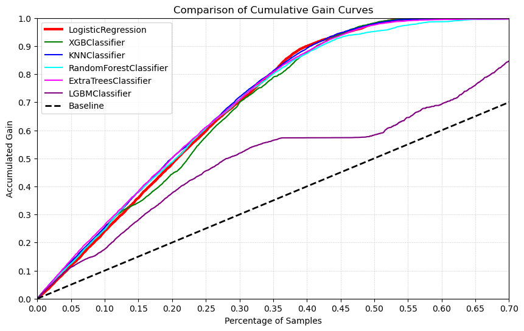
</td></tr>
</table>

CONCLUSION: Based on the test results above, the LOGISTIC REGRESSION algorithm was chosen for use in this project, as it presented the highest number of *True Positive* (TP) cases, which is reflected in the favorable F1, *Precision*, and especially *Recall* scores.

NOTE AND SUGGESTION FOR THE NEXT TEST: Although the indicators point to *Logistic Regression* as the best choice and *Extra Trees* as one of the least suitable, when enlarging the comparison graph of the curves, contradictory information appears, as shown in the figure below.

<table align="center">
<tr><td>
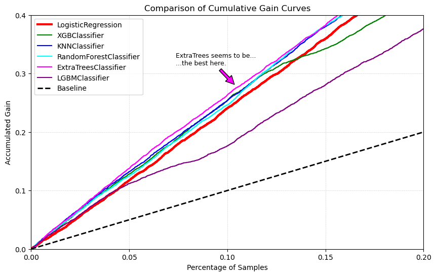
</td></tr>
</table>

Thus, as a suggestion for the next test, it would be worth comparing the business performance of both the *Logistic Regression* and *Extra Trees* algorithms.


# 8. RESULT-I: KEY BUSINESS INSIGHTS

As presented in section 4.1 above, the final product includes insights derived from analyzing the available data. This is a very important aspect, as it provides a foundation for discussing new sales strategies.

When analyzing the insurance market, it is crucial to investigate the events that affect business performance. The mind map below presents some phenomena capable of influencing demand. These include:

- Customer characteristics: gender, age, risk perception, place of residence, education level, among others.
- Vehicle characteristics: age, market price, embedded technology.
- Insurance contract characteristics: premium amount, marketing campaigns, market competition.
- Government policies: tax incentives.
- External factors: percentage of automotive accidents, natural disasters.

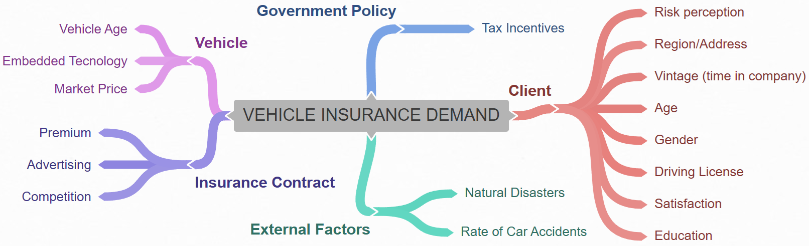

In the case of this project, based on the investigation of the available data (section 5.3 of the code), the following key insights were identified:

## Insight #1: Consumer gender does not influence interest in insurance.
**FALSE Hypothesis**: The data shows a higher acceptance rate for auto insurance contracts among the male population, with 13.82% of men compared to only 10.38% of women. Additionally, the male population is slightly larger (109,828 men alongside 93,440 women). Combining these numbers, we find a total of 15,181 men interested in insurance and only 9,698 women interested.

Thus, contrary to the initial hypothesis, gender does have some impact on insurance demand.

## Insight #2: Interest in insurance contracts increases with age.
**TRUE Hypothesis**: The numbers indicate that in the group of people aged 21 to 25, only 3.6% are interested in purchasing auto insurance. On the other hand, 21.5% of people aged 39 to 47 have shown interest in buying insurance.

These relationships between age and interest are reflected in the distributions of the "age" versus "response" variables, as shown in the graph.

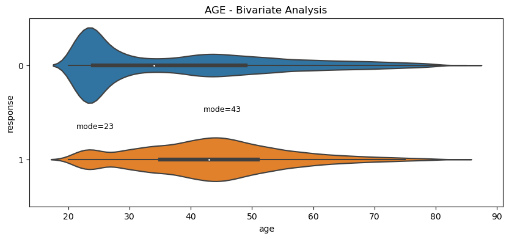

Thus, we conclude that, indeed, interest in insurance contracts increases with age.

## Insight #3: People who already have insurance contracts with other companies tend to be less likely to become our customers.
**TRUE Hypothesis**: In the available dataset, 46% of people already had a vehicle insurance contract, and 99.9% of these individuals responded negatively to the survey regarding interest in the auto insurance offer.

On the other hand, among the remaining 54% of people who do not have vehicle insurance, 22.56% expressed interest in the new product.

<table align="center">
    <tr>
        <td colspan=2 rowspan=2 align="center"><b>%</b></td>
        <td colspan=2 align="center"><b>response</b></td>
    </tr>
    <tr>
        <td align="center"><b>0</b></td>
        <td align="center"><b>1</b></td>
    </tr>
    <tr>
        <td rowspan=2><b>previously_insured</b></td>
        <td><b>0</b></td>
        <td align="center">77.44%</td>
        <td align="center">22.56%</td>
    </tr>
    <tr>
        <td><b>1</b></td>
        <td align="center">99.91%</td>
        <td align="center">0.09%</td>
    </tr>
</table>

## Insight #4: The newer the vehicle, the greater the interest in our auto insurance.
**FALSE Hypothesis**: The data shows that customers with newer cars are less inclined to purchase vehicle insurance. Considering only the group of customers who do not yet have auto insurance (i.e., with "previously_insured" = zero), we find the following percentages of people interested in our product:

<table align="center">
  <tr>
    <th align="center">"vehicle_age"</th>
    <th align="center">Interested</th>
    <th align="center">Not Interested</th>
  </tr>
  <tr>
    <td align="center">below_1_year</td>
    <td align="center">12.88%</td>
    <td align="center">87.12%</td>
  </tr>
  <tr>
    <td align="center">between_1_2_years</td>
    <td align="center">25.72%</td>
    <td align="center">74.28%</td>
  </tr>
  <tr>
    <td align="center">over_2_years</td>
    <td align="center">29.46%</td>
    <td align="center">70.54%</td>
  </tr>
</table>

Thus, contrary to the original hypothesis, the newer the vehicle, the lower the interest in auto insurance.


# 9. RESULT-II: IMPACT ON THE SALES CAMPAIGN

As presented in section 4.1 above, the final product includes answers to three questions related to the sales campaign to be implemented by the client company. Below are the results of the processing on the test data, followed by the questions and corresponding answers.


## 9.1. Results of Applying the Model to the Test Data

The idea is to compare the results of the sales strategy with and without the use of *machine learning*.

TEST DATA:
The test dataset contains 127,000 records (or 127,024), of which 15,625 (12.30%) refer to individuals interested in purchasing the product (class-1). Note that due to the randomization of the data, the value of 12.30% in this sample shows a small difference compared to the theoretical value of 12.23% originally expected.

<table align="center">
  <tr>
    <th>Totals</th>
    <th>Value</th>
  </tr>
  <tr>
    <td>Tested Population</td>
    <td align="center">127,024</td>
  </tr>
  <tr>
    <td>Interested Population</td>
    <td align="center">15,625 (12.30%)</td>
  </tr>
  <tr>
    <td>Total Revenue (health insurance)</td>
    <td align="center">$493,804,649.00</td>
  </tr>
</table>

In the data above, the total revenue of $494 million refers to the sum of known values, specifically the health insurance premiums of the 15,625 class-1 records. For evaluation purposes, this information will be taken as an estimate of the revenue to be generated from the sale of the new auto insurance.

The business questions and the results achieved are presented in the sections below and can be summarized in the following graph:

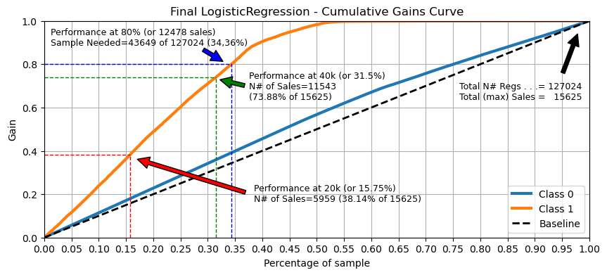


## 9.2. Question 1: With 20,000 calls, what should be the percentage of customers interested in the product?

In the case **without using ML**, the 20,000 records are chosen randomly. Under these conditions, the calculation resulted in 2,467 interested individuals (12.34% of 20,000), representing revenue of $77,227,245.00.

By **using the ML model** for intelligent customer list prioritization, it was possible to identify 6,921 interested individuals (29.8% of 20,000), representing revenue of $217,376,323.00.

**Result**: a 141.5% increase in the number of contracts, with a 181.5% increase in revenue.


## 9.3. Question 2: And what about 40,000 calls?

In the case **without using ML**, the 40,000 records are chosen randomly. Under these conditions, the calculation resulted in 4,953 interested individuals (12.38% of 40,000), representing revenue of $155,421,139.00.

By **using the ML model** for intelligent customer list prioritization, it was possible to identify 11,543 interested individuals (28.86% of 40,000), representing revenue of $389,342,460.00.

**Result**: a 133.1% increase in the number of contracts, with a 150.5% increase in revenue.


## 9.4. Question 3: How many calls will be necessary to reach 80% of the interested customers?

In this case, the data indicates that a sample of 43,649 people will be needed, representing 34.36% of the total 127,024.


# 10. RESULT-III: INTELLIGENT EXCEL SPREADSHEET

With the aim of facilitating the use of the prediction algorithm through an Excel spreadsheet, a two-step solution was constructed. On one side, the ML algorithm was deployed as a cloud WebService on the [RENDER](https://render.com/) website, making it widely accessible via https://health-insurance-priv.onrender.com/healthinsurance/predict URL.

On the other side, a routine was built in Excel VBA to function as a WebService client. From the user’s perspective, she only needs to input clients' data into the spreadsheet in the proper column order, as shown in the figure below, select the row or rows for which they want to obtain a purchase probability prediction, and press CONTROL+SHIFT+P.

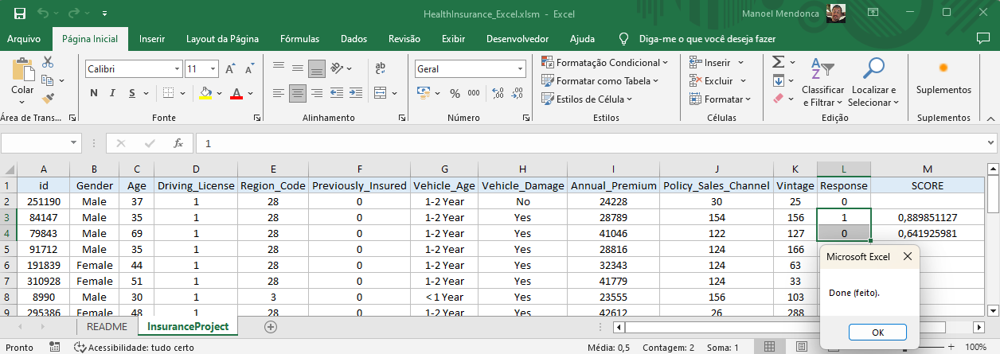

As a result of this development, the prediction algorithm can be used through a popular tool like MS Excel, allowing the project to be integrated into the company’s daily operations.


# 11. RESULTS ACHIEVED & CONCLUSION

Through this project, a business case was analyzed with the goal of increasing the reach of an insurance company's sales campaign. The challenge was to create an intelligent method to select customers most likely to purchase a new product from the company.

As a result of this project: (i) business insights were developed from the data, (ii) a machine based on the *Logistic Regression* algorithm was built to predict the purchase propensity of a group of surveyed individuals, with the capacity to triple the sales campaign's outcome, and (iii) an Excel spreadsheet was created, integrated with the prediction system to provide real-time information.


# 12. NEXT STEPS

Among the possible improvements for the project, there is the opportunity to enhance the data collection phase by including new business-relevant information, such as specific characteristics of vehicle insurance contracts, socio-economic characteristics of the company's operational regions, among others, as discussed in section 8 of this document.


# 13. TOOLS USED

In the development of this project, the following tools were used:
- Python Programming Language, version 3.11.9
- GIT for version control
- Jupyter Notebook & Visual Studio Code
- Hosting service [Render.com](https://render.com/)
- Data manipulation techniques with Python
- Feature selection techniques using Boruta
- Machine learning algorithms from the scikit-learn library
- Flask library<sup>5</sup>
- ChatGPT 4.o

Additionally, the original Portuguese version of this text was prepared without the help of generative AI. However, its translation into English was done using ChatGPT, with our review. The initial brainstorming for section 8 of this document also involved ChatGPT. Tables written in markdown format were converted to more versatile HTML tables using ChatGPT. Finally, during the development of the code, ChatGPT was occasionally used to identify possible coding errors in Python, adjust some functions, and enhance certain graphics.


# 14. REFERENCES

1. Kaggle website, available at https://www.kaggle.com/datasets/anmolkumar/health-insurance-cross-sell-prediction, accessed in August 2024.
2. Book: *Hands-On Machine Learning with Scikit-Learn, Keras & TensorFlow*, Aurélien Géron, 3rd edition, 2023.
3. Book: *Python for Finance Cookbook*, Erik Lewinson, 2nd edition, 2022.
4. Book: *Machine Learning Bootcamp - Build a portfolio of real-life projects*, Alexey Grigorev, 2021.
5. Flask library documentation, available at https://flask.palletsprojects.com/en/2.3.x/api/#flask.Blueprint.route, accessed on February 8, 2024.
6. I would like to thank everyone who provided improvement suggestions, as mentioned in the comments on this [post](https://www.linkedin.com/posts/manoelmendonca-eng-adv_mais-um-projeto-de-ci%C3%AAncia-de-dados-conclu%C3%ADdo-activity-7240429424578359297-35bd?utm_source=share&utm_medium=member_desktop).
